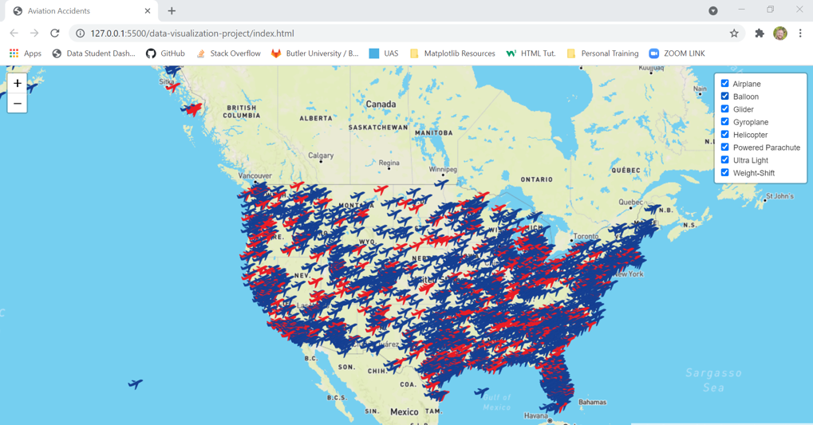

# Aviation Accident Visualization 2019-2021

The purpose of this project was to show a interactive visualization for Aviation Accident data in the United States. I decided to continue on project after and make the visualization as strong as possible.

## Data Collection

Found data from kaggle [aviation]https://www.kaggle.com/khsamaha/aviation-accident-database-synopses?select=AviationData.csv, downloaded, and saved locally.

## Data Cleaning

Took this data and determined what data was absolutely necessary to cut down on data I did not need. This infomation started in 1962 and contained information on 84 thousand plus accidents so I wanted to narrow down data. Ultimately decided to use only accidents in the US and from years 2019 to 2021. This still gave me a decent sized data set, but it was not too big to slow down visualization.

## Structure

In creating this visual I decided to use Javascript, HTML, and CSS to create a map displaying markers and layers of different accident data. I started with a html file and wrote out bones of website. Next created logic via javascript to put everything together. In creating a map I always use mapbox, so I added code and api key to utilize their mapping. Then proceeded by using d3 library to create code to pull in data and implement into my map. I thought it would be cool to show different markers (red for fatal accidents and blue for non-fatal) and create different layers for the type of aircrafts (airplane, helicopter, balloon, etc.)

## 

- Contact
- mattweiper@gmail.com
- 
